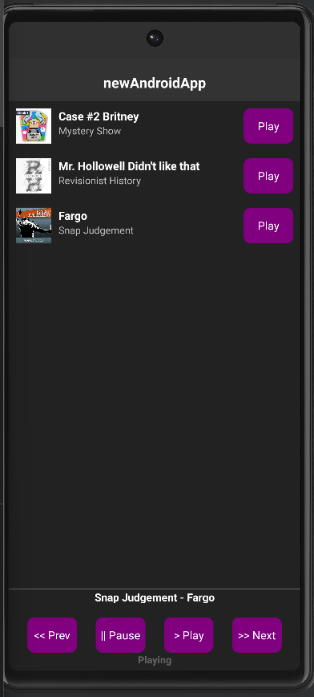
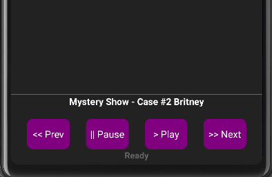

# RN Podcast Audio Player

This app was designed to list the episodes provided in `episodes.json` and allow a user to play a particular track, or skip to the next track or previous track. The user can also pause or resume playing with the controls at the bottom. 

## Questions

The answers to these [questions](./assets/answers.md) are included in the project.

* If you have more time to do UI / UX improvements, what improvements would you make?

* Do you see any pros / cons with react-native-track-player?

* How would you go about implementing offline listening for the episodes?

## Dependencies and Versions

* I used [https://github.com/react-native-kit/react-native-track-player](https://github.com/react-native-kit/react-native-track-player) for the audio capabilities. Version 3.2.0 at the time.
* Android SDK 33 primarily, but Android SDK 31 was installed as well.
* Java version 11 (openJDK)
* [Axios](https://github.com/axios/axios)

## Screenshots

> Here is the main view of the app

> When a user has paused the app and goes to a new track with Prev or Next, it does not start playing but indicates it is ready. This functionality could be changed if more convenient.

## Setup Troubleshooting

I used android studio without Expo for this project, and after installing the packages using npm I had to follow these steps.

1. Ensure the correct SDK kit is setup. The emulator I used most was: `Pixel 6 API 31` which relied on `Android 12.0(S) SDK Kit 31` but my Android SDK manager used `Android 13.0(Tiramisu) SDK 33` for the target SDK of the application as well as `Build Tools 33` target for the emulator to work properly. This was likely due to how I set up the project, and I am unsure why that version of build tools was automatically included but it was necessary for the build to work. I had originally intended to build on Android 12 SDK 31.
2. Start your emulator in Android Studio. This can be done by clicking the play button beside the emulator in the device list.
3. Use `npx react-native start` to start the metro bundler. I ran this in Windows Powershell but your environment may differ.
4. Run `npx react-native run-android` to start the app on the emulator. 

Setting up the project often ran into issues, but these were the steps that resolved them. I was developing on a windows environment for this project because WSL2 was causing far too much difficulty getting the emulator to connect to the app and my drive with Linux needs to be reinstalled on my main computer still.  Due to this, the project is not set up for iOS devices and would require a few extra steps for [React-Native-Track-Player](https://github.com/react-native-kit/react-native-track-player).